# Google Slides API Implementation Plan

> **Goal**  Automatically turn each generated itinerary into a branded, image-rich Google Slides presentation via a single **Connect to Slides** button in the UI.

---
## 1 High-Level Flow

1. **Perplexity** generates the raw itinerary (already implemented).
2. **Connect to Slides** button (frontend) calls `/api/slides`.
3. Backend route:
   1. **ChatGPT-4o** – rewrites Perplexity text into branded copy.
   2. **Google Slides API** – copies a template deck, then batch-updates text + images.
4. Route returns the **Slides URL** → Frontend shows a success toast & opens the deck.

```mermaid
sequenceDiagram
    participant U as User
    participant FE as Next.js Frontend
    participant BE as Next.js API Route
    participant GPT as ChatGPT-4o API
    participant GS as Google Slides API

    U->>FE: click "Connect to Slides"
    FE->>BE: POST /api/slides (itinerary JSON, image URLs)
    BE->>GPT: refine itinerary text
    GPT-->>BE: polished copy
    BE->>GS: copy template & batchUpdate(text+images)
    GS-->>BE: presentationId / shareLink
    BE-->>FE: { slidesUrl }
    FE-->>U: open new tab → Google Slides
```



---
## 2 Google Cloud Setup

- [x] **2.1** Create/choose a Google Cloud project
- [x] **2.2** **Enable APIs**: Slides API + Drive API
- [x] **2.3** **Create Service Account** → download `credentials.json`
- [x] **2.4** In Google Drive, share your **Slides template deck** with the service-account email (`itinerary-creator-slide-creato@itinerary-builder-468012.iam.gserviceaccount.com`)
- [x] **2.5** **Encode** the entire `credentials.json` as a single base-64 string and save it as a Vercel env var named `GOOGLE_SERVICE_ACCOUNT_BASE64`. Store locally in `config/credentials.json`.

Default quotas are ~60–120 write requests **per minute** → more than enough & **free**.

---
## 3 Template Deck Conventions (+ multi-option variants)

- [x] **3.1** Keep master template in Drive with unique placeholder text
- [x] **3.2** Use placeholder tokens like `<<Option1_Title_Main>>`, `<<Option1_Facts>>`, etc.
- [x] **3.3** Set up 1-option template with all required placeholders
- [ ] **3.4** Create additional templates for 2-5 options (pending)

### Google Drive Folder Structure
**Main Folder**: [Luxury Itinerary System](https://drive.google.com/drive/u/0/folders/1HFHEMUiPKRnKz2NMftVeg__xXfcsV1s5)
- **Templates Folder**: [Templates](https://drive.google.com/drive/u/0/folders/1xe6aI9hBczHcxLzrFqjBOBn28UKLyHD-) - `1xe6aI9hBczHcxLzrFqjBOBn28UKLyHD-`
- **Generated Presentations Folder**: [Itineraries](https://drive.google.com/drive/u/0/folders/1yxVbHPxFWKrtpuNql8hbeJQIzFkqlS3f) - `1yxVbHPxFWKrtpuNql8hbeJQIzFkqlS3f`

### Multiple-Option Templates (1-5)
**Status**: Currently only 1-option template is ready. Will create 2-5 option templates later.

| Choices | Template name | Template URL | File ID | Status |
|---------|---------------|--------------|---------|---------|
| 1 option | `Itinerary Template 1 Option (Danny)` | [Template Link](https://docs.google.com/presentation/d/1hyNyTr57hoCEMHBvK3uqvw_5vXGw3akoLaVNIVkkZKs/edit) | `1hyNyTr57hoCEMHBvK3uqvw_5vXGw3akoLaVNIVkkZKs` | 🎉 **WORKING IN PRODUCTION!** |
| 2 options | `Itinerary-Template-2` | TBD | `TEMPLATE_ID_2` | ⏳ Pending |
| 3 options | `Itinerary-Template-3` | TBD | `TEMPLATE_ID_3` | ⏳ Pending |
| 4 options | `Itinerary-Template-4` | TBD | `TEMPLATE_ID_4` | ⏳ Pending |
| 5 options | `Itinerary-Template-5` | TBD | `TEMPLATE_ID_5` | ⏳ Pending |

At runtime the API route will:
1. Inspect `numberOfOptions` coming from the UI.
2. Pick the corresponding template ID.
3. **Copy** that template → `presentationId`.
4. Replace placeholders for each option that actually exists.

(If you prefer a **single** mega-template you can also duplicate/delete slides via the Slides API, but separate template files are simpler and faster.)

### Placeholder Naming Rules
For N-option templates use the same predictable pattern so the code can loop:

```
<<Option1_Title>>
<<Option1_Image>>
<<Option1_Overview>>
<<Option1_Cost>>

<<Option2_Title>>
<<Option2_Image>>
… etc …
```

Make sure every textbox contains only the placeholder token (no extra spaces) so `replaceAllText` works 1-to-1.

### Image Frames
If you want to preserve exact positioning, leave a rectangular shape or an existing image filled with a placeholder photo; give it ALT-text equal to the token (e.g. `Option1_Image`).  The code can search for that shape’s objectId and then `replaceImage` or `createImage` at the same coordinates.

---
## 3.1  One-Option Template — Placeholder Map & Length Targets

| Slide # | Visible Title | Placeholder ID(s) | GPT-4o Target Length |
|---------|---------------|-------------------|----------------------|
| 1 | *Cover* | *(None – keep as-is)* | – |
| 2 | Your Itinerary Options | `<<Trip_Destination>>`  \|  `<<Trip_Dates>>` | destination ≤ 40 chars  •  dates in short form e.g. "7 – 21 Nov 2025" |
| 3 | Option 1 hero | `<<Option1_Title_Main>>` | ≤ 60 chars |
| 4 | Option 1 facts | `<<Option1_Title_Main>>`  |  
`<<Option1_Facts>>` (multi-line) | each fact line ≤ 80 chars  (6–7 lines max) |
| 5 | Overview | `<<Option1_Overview>>` | ≤ 800 chars  (paragraph style) |
| 6 | Why This Trip | `<<Option1_DetailedNarrative>>` | ≤ 900 chars |
| 7 | Room Details | `<<Option1_RoomDetails>>` | ≤ 500 chars |
| 8 | Room Sub-Details | `<<Option1_RoomDetails2>>' body ≤ 350 chars each |
| 9 | Optional Extras (title fixed) | *(no placeholder in title slide)* |
| 10 | Extras page 1 | `<<Option1_Extra1>>` | ≤ 600 chars |
| 11 | Extras page 2 | `<<Option1_Extra2>>` | ≤ 600 chars |
| 12–13 | Image spreads | *(no text placeholders – keep static images for now)* |
| 14 | Cost Breakdown | `<<Option1_CostList>>` (bullets)  \|  `<<Option1_TotalCost>>` | each bullet ≤ 60 chars • total line ≤ 45 chars |

#### GPT-4o JSON Contract (single-option)
```jsonc
{
  "trip_destination": "Maldives",
  "trip_dates": "7 – 21 Nov 2025",
  "option1": {
    "title_main": "The St. Regis Maldives Vommuli Resort",
    "facts": "Location: Dhaalu Atoll\nDates: 7–21 Nov 2025\nHotel: St. Regis Maldives\nRoom: Overwater Villa with Pool\nFlights: BA LHR-MLE (Business)\nGround: Private seaplane",
    "overview": "…",
    "why_trip": "…",
    "room_details": "…",
    "roomA": { "title": "Two-Bedroom Villa…", "body": "…" },
    "roomB": { "title": "Deluxe Junior Suite…", "body": "…" },
    "extra1": "…",
    "extra2": "…",
    "cost_list": "• Flights: £3,400–3,800\n• Accommodation: £7,800–8,600\n• Transfers: £1,100–1,300\n• Service Fee: £1,230–1,270",
    "total_cost": "TOTAL: £13,530 – £15,000"
  }
}
```

---
### 3.2  N-Option Templates (2-5)
For every extra option replicate the same placeholder pattern with the index incremented (`Option2_Title_Main`, `Option3_Overview`, etc.).  Slides unique to each option should follow after the previous option’s cost page.

---
### 3.3  ChatGPT-4o Prompt Skeleton
```
System: You are a luxury-travel copywriter. Follow JSON schema strictly.
User: Rewrite the itinerary below to fit these length limits and placeholders.
Return JSON matching the schema for N = {numberOfOptions}.

<PASTE RAW PERPLEXITY OUTPUT>
```

GPT response will be parsed and values dropped into `replaceAllText` requests.


---
## 4 Node Helper (lib/googleSlides.ts)

- [x] **4.1** Install googleapis package
- [x] **4.2** Create authentication helper functions
- [x] **4.3** Set up template ID constants
- [x] **4.4** Define ItineraryData interface

✅ **Implemented**: `lib/googleSlides.ts` with `getSlidesClient()`, `getDriveClient()`, and template management.

---
## 5 Backend Route (`/app/api/slides/route.ts`)

- [x] **5.1** Parse body → `{ itinerary, images }`
- [x] **5.2** **Copy** template deck (Drive API) → `presentationId`
- [ ] **5.3** **Call ChatGPT-4o** once with a structured prompt → receive polished text per section
- [x] **5.4** Build a **batchUpdate** array with `replaceAllText` for each placeholder
- [x] **5.5** Implement image replacement via `replaceImage` for hotel images
- [x] **5.6** Execute `slides.presentations.batchUpdate({ presentationId, requestBody: { requests } })`
- [x] **5.7** Respond with `{ slidesUrl: https://docs.google.com/presentation/d/${presentationId}/edit }`
- [x] **5.8** Error handling → return 500 + message

✅ **Implemented**: Basic `/api/slides/route.ts` with template copying, text replacement, and image insertion. **Pending**: ChatGPT-4o integration.

---
## 6 Frontend Button Logic

- [x] **6.1** Implement `createSlides()` function to call `/api/slides`
- [x] **6.2** Wire up "Connect to Slides" button onClick handler
- [x] **6.3** Add loading states and error handling
- [x] **6.4** Open generated slides URL in new tab

✅ **Completed**: Frontend integration working in production! Button successfully creates and opens Google Slides presentations.

---
## 7 ChatGPT-4o Integration

- [x] **7.1** Set up OpenAI API client
- [x] **7.2** Create prompt template for itinerary rewriting
- [x] **7.3** Implement text length limits per slide section
- [x] **7.4** Add JSON schema validation for GPT response
- [x] **7.5** Integrate into `/api/slides` route before template population

✅ **Completed**: ChatGPT-4o integration implemented in `lib/openai.ts` and integrated into `/api/slides/route.ts`.

---
## 8 Vercel Runtime & Timeout Settings

- [ ] **8.1** Configure route timeout settings for Slides API calls
- [ ] **8.2** Add `maxDuration: 30` to handle GPT-4o + Slides API processing
- [ ] **8.3** Test timeout limits under load

⏳ **Pending**: Vercel configuration optimization.

---
## 9 Optional Supabase Persistence

- [ ] **9.1** Create `slides_exports` table schema
- [ ] **9.2** Add database insert after successful slides creation
- [ ] **9.3** Build UI to query past slide decks
- [ ] **9.4** Add user authentication integration

⏳ **Future enhancement**: Database persistence for exported slides history.

---
## 10 Edge Cases & Best Practices

- [x] **10.1** Handle missing images gracefully
- [x] **10.2** Implement error handling for API failures
- [ ] **10.3** Add rate-limit handling (HTTP 429) with exponential backoff
- [ ] **10.4** Implement text length validation and truncation
- [x] **10.5** Secure service-account key (server-side only)
- [ ] **10.6** Set up monitoring for API quotas

⚠️ **Partially implemented**: Basic error handling in place, advanced features pending.

---
## 11 Main Task Checklist

- [x] Add `googleapis` to `package.json`
- [x] Place `credentials.json` in `config/` & git-ignore it
- [x] Build `lib/googleSlides.ts` (auth helper)
- [x] Create `/api/slides/route.ts` implementing core functionality
- [x] Test Google authentication and template access
- [x] Add ChatGPT-4o integration for text refinement
- [x] Update UI button to call `createSlides()`
- [x] **🎉 Test end-to-end: generate itinerary → Slides deck link - WORKING!**
- [ ] Add comprehensive error handling and monitoring

---
## 12 Resources

* Slides API reference: <https://developers.google.com/workspace/slides>
* Drive API – Copy File: <https://developers.google.com/drive/api/guides/folder>
* Node.js googleapis docs: <https://github.com/googleapis/google-api-nodejs-client>
* ChatGPT-4o API docs: <https://platform.openai.com/docs>

---
## 📊 Current Status Summary

### ✅ **COMPLETED**
- Google Cloud project setup and API enablement
- Service account creation and authentication 
- Template sharing and access verification
- Core library setup (`lib/googleSlides.ts`)
- Basic API route implementation (`/app/api/slides/route.ts`)
- Local development environment configuration
- Vercel environment variable setup
- **🎉 WORKING END-TO-END: 1-option itinerary to Google Slides!**
- ChatGPT-4o integration for text refinement
- Frontend button integration
- End-to-end testing for single option templates
- **Successful production deployment and testing**

### ⏳ **IN PROGRESS** 
- Multi-option template creation and testing (2-5 options)
- Image integration improvements
- Redis environment variable configuration

### 📋 **PENDING**
- Multi-option template creation (2-5 options)
- Image integration enhancement (currently shows "no images found")
- Advanced error handling and monitoring
- Vercel timeout configuration
- Redis environment variables (UPSTASH_REDIS_REST_URL, UPSTASH_REDIS_REST_TOKEN)
- Optional database persistence for slides history

---
## 🎉 **MAJOR MILESTONE ACHIEVED!**

### **✅ WORKING IN PRODUCTION:**
- **Date**: January 6, 2025
- **Status**: End-to-end Google Slides integration is **LIVE** and working!
- **Test Results**: Successfully generated a Maldives itinerary and automatically created a branded Google Slides presentation
- **Flow**: Itinerary Builder → Connect to Slides Button → ChatGPT-4o text refinement → Google Slides API → Beautiful presentation opened in new tab

### **Known Issues to Address:**
1. **Images**: Console shows "Images found: 0" - need to enhance image integration
2. **Redis Config**: Missing `UPSTASH_REDIS_REST_URL` and `UPSTASH_REDIS_REST_TOKEN` environment variables

### **Next Priority:**
1. Fix Redis environment variables for data persistence
2. Enhance image search and integration
3. Create 2-5 option templates for multi-choice itineraries

---
### ❗️ Reminder
The **Slides API has no cost**; stay within per-minute quotas and you are good to go.
